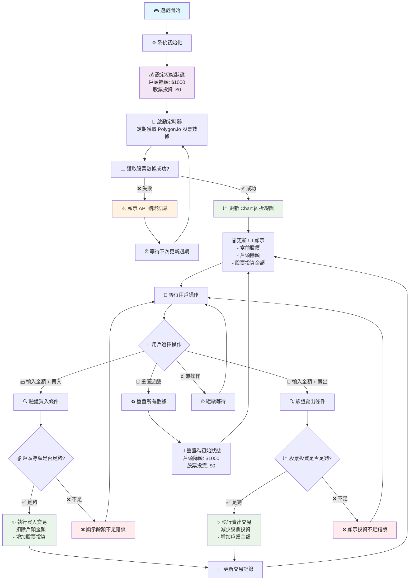

# 股票投資小遊戲流程圖

## 系統概述
這是一個模擬股票投資的網頁小遊戲，使用 Polygon.io API 獲取真實股票數據，並通過 Chart.js 顯示股價走勢。玩家可以進行買入和賣出操作，管理自己的虛擬投資組合。

## 主要功能
- 使用 Polygon.io API 獲取股票數據（免費額度，低頻率更新）
- Chart.js 折線圖顯示股價走勢
- 玩家戶頭管理（初始金額 $1000）
- 股票買入/賣出功能
- 投資金額追蹤
- 重置功能

## 系統流程圖

## 技術實現要點

### API 集成
- 使用 Polygon.io 免費 API 獲取股票數據
- 設定適當的請求頻率以避免超出免費額度
- 實現錯誤處理和重試機制

### 圖表顯示
- 使用 Chart.js 創建響應式折線圖
- 實時更新股價數據
- 提供良好的視覺化體驗

### 用戶界面
- 清晰顯示戶頭餘額和投資金額
- 直觀的買入/賣出操作界面
- 即時的交易反饋和錯誤提示

### 數據管理
- 本地存儲用戶的投資狀態
- 交易記錄的追蹤和顯示
- 重置功能的完整實現
